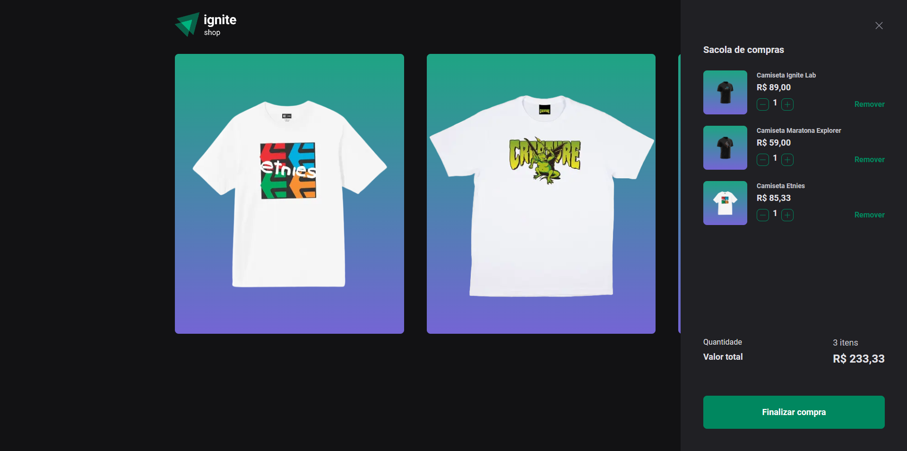

<p align="center">
  
   
  
</p>

<p align="center">
  <a href="#dart-sobre">Sobre</a> &#xa0; | &#xa0;
  <a href="#rocket-tecnologias">Tecnologias</a> &#xa0; | &#xa0;
  <a href="#warning-pré-requisitos"> Pré requisitos</a> &#xa0; | &#xa0;
  <a href="#checkered_flag-começando">Começando</a> &#xa0; | &#xa0;
  <a href="#memo-licença">Licença</a> &#xa0; | &#xa0;
  <a href="https://github.com/geovaneborba" target="_blank">Autor</a>
</p>

<br>

## :dart: Sobre

<p>
  O Ignite Shop foi um desafio realizado durante o programa ignite da <a href='https://www.rocketseat.com.br/' target="_blank">Rocketseat</a>, onde
  foi solicitado a implementação de um carrinho de compras que utiliza os dados da API do Stripe para buscar os itens existentes, e controlar, através da aplicação, o número de itens que a pessoa deseja comprar. E enviar os itens adicionados no carrinho para a rota de checkout, que irá redirecionar para o checkout no stripe para realizar o pagamento dos itens. Após realizar o checkout no Stripe redirecionar o usuário de volta para uma rota de sucesso com os dados da compra.

Foi trabalhado conceitos importantes do Next como por exemplo:

- Server Side Rendering (SSR)
- Static Site Generation (SSG)
- Data Fetching
- Routing
- SEO

🎯 <a href="https://efficient-sloth-d85.notion.site/Desafio-04-Adicionando-features-ao-Ignite-Shop-91e5b2c26c9342f5b1375ba66907d0b7" target="_blank">Clique aqui para acessar o desafio ⬅️</a>

Além de concluir o desafio eu também realizei alguns extras:

- Responsividade, adaptei o layout para funcionar em dispositivos móveis
- Deploy na Vercel

</p>

<p align="right">(<a href="#top">Voltar para o topo</a>)</p>

## :rocket: Tecnologias

As seguintes tecnologias foram usadas na construção do projeto:

- [Next.js](https://nextjs.org/)
- [TypeScript](https://www.typescriptlang.org/)
- [Stripe](https://stripe.com/br)
- [Stitches](https://stitches.dev/)
- [Eslint](https://eslint.org/)
- [Prettier](https://prettier.io/)

<p align="right">(<a href="#top">Voltar para o topo</a>)</p>

## :warning: Pré-requisitos

Antes de começar, você precisa ter o [Git](https://git-scm.com) e o [Node](https://nodejs.org/en/) instalados em sua maquina.

<p align="right">(<a href="#top">Voltar para o topo</a>)</p>

## :checkered_flag: Começando

```bash
# Clone este repositório
$ git clone https://github.com/geovaneborba/ignite-shop.git

# Entre na pasta
$ cd ignite-shop

# Instale as dependências
$ npm install

# Em desenvolvimento será necessário adicionar suas KEY da api do stripe no arquivo .env.local na raiz do projeto conforme o .env.local.example...
# Stripe
STRIPE_PUBLIC_KEY=""
STRIPE_SECRET_KEY=""

# Para iniciar o projeto
$ npm run dev

# O app vai inicializar e será informado no terminal o endereço e porta onde estará rodando a aplicação
# geralmente é http://localhost:3000/
```

<p align="right">(<a href="#top">Voltar para o topo</a>)</p>

## :memo: Licença

Este projeto está sob licença MIT. Veja o arquivo [LICENSE](LICENSE.md) para mais detalhes.

<p align="right">(<a href="#top">Voltar para o topo</a>)</p>

<p align="center">Feito com ❤️ por <a href="https://github.com/geovaneborba" target="_blank">Geovane Borba</a></p>
